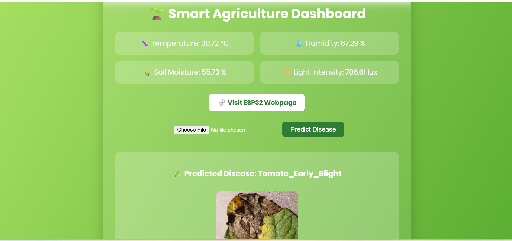
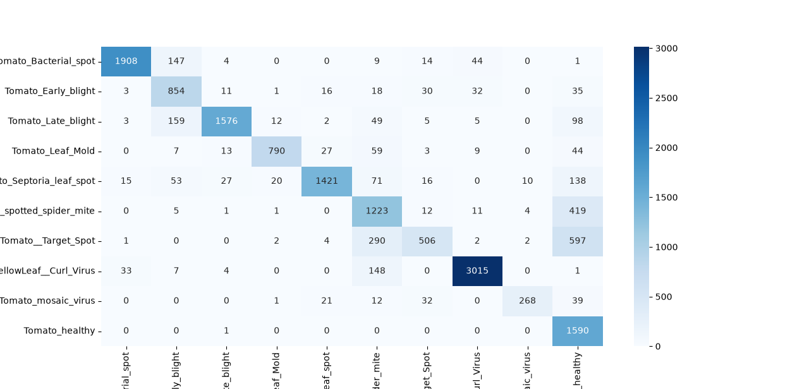

# 🌱 Smart Greenhouse Agriculture with AI/ML

An intelligent **Smart Greenhouse Monitoring System** that combines **Artificial Intelligence, Machine Learning and IoT** to monitor greenhouse conditions and detect tomato leaf diseases.

The system integrates **ESP32 sensors** with a **CNN-based disease classification model** to assist farmers in monitoring crop health and environmental conditions in real time.

---

# 📖 Overview

Agriculture suffers significant crop losses due to late disease detection and improper environmental monitoring.

This project aims to solve these challenges by combining:

- 🌿 Tomato Leaf Disease Detection using Deep Learning
- 🌡️ Greenhouse Environmental Monitoring
- 📷 Image Classification
- 🤖 AI-assisted Decision Making
- 🌐 Web Dashboard

The system allows users to upload tomato leaf images and instantly predicts the disease while simultaneously displaying greenhouse sensor readings.

---

# ✨ Features

- 🌿 Tomato Leaf Disease Detection
- 🌡️ Temperature Monitoring
- 💧 Soil Moisture Monitoring
- 💨 Humidity Monitoring
- ☀️ Light Intensity Monitoring
- 📷 Image Upload & Prediction
- 🌐 Flask Web Dashboard
- 📊 Real-time Sensor Display
- 🤖 CNN-based Deep Learning Model

---

# 🛠 Tech Stack

## Languages

- Python
- C++
- HTML
- CSS

## Machine Learning

- TensorFlow
- Keras
- NumPy
- Matplotlib
- seaborn

## Backend

- Flask

## Hardware

- ESP32
- DHT11 Sensor
- Soil Moisture Sensor
- LDR Sensor
- MQ135 Air Quality Sensor
- Water Pump
- DC Fan
- LED Light

## Tools

- Arduino IDE
- VS Code
- Git
- GitHub

---

# 🏗 System Architecture

```
                    Tomato Leaf Image
                            │
                            ▼
                 Image Preprocessing
                            │
                            ▼
                    CNN Classification
                            │
                            ▼
                  Disease Prediction
                            │
                            ▼
                 Flask Web Dashboard
                            ▲
                            │
                  ESP32 Sensor Readings
                            │
      ┌──────────────┬──────────────┬──────────────┐
      │              │              │              │
 Temperature     Humidity     Soil Moisture     Light
```


---

# 🦠 Diseases Detected

The model classifies the following tomato leaf diseases:

- Tomato Bacterial Spot
- Tomato Early Blight
- Tomato Late Blight
- Tomato Leaf Mold
- Tomato Septoria Leaf Spot
- Tomato Spider Mites
- Tomato Target Spot
- Tomato Yellow Leaf Curl Virus
- Tomato Mosaic Virus
- Healthy Tomato Leaf

---

# 📊 Model Performance

| Metric | Value |
|---------|-------|
| Model | CNN |
| Classes | 10 |
| Test Images | 16,011 |
| Test Accuracy | **82.14%** |
| Optimizer | Adam |
| Epochs | 25 |
| Image Size | 128×128 |

### Performance Summary

- Excellent detection of Healthy Leaves.
- High accuracy for Tomato Yellow Leaf Curl Virus.
- Strong performance for Bacterial Spot and Late Blight.
- Target Spot remains the most challenging class because of visual similarity with Spider Mites and Healthy leaves.


# 📸 Application Screenshots

## Home Page



## Confusion Matrix



# 📂 Project Structure

```
Smart-Agriculture-with-Ai-ML/
│
├── app.py
├── train_model.py
├── test.py
├── requirements.txt
├── README.md
│
├── model/
│
├── dataset/
│
├── static/
│
├── templates/
│
├── images/
│
└── ...
```

---

# ⚙ Installation

Clone the repository

```bash
git clone https://github.com/adityakumar373/Smart-Agriculture-with-Ai-ML.git
```

Move into the project directory

```bash
cd Smart-Agriculture-with-Ai-ML
```

Install dependencies

```bash
pip install -r requirements.txt
```

Run the application

```bash
python app.py
```

Open your browser

```
http://127.0.0.1:5000
```

---

# 🧠 Model Training

Train the CNN model

```bash
python train_model.py
```

The trained model is saved in the `model/` directory.

---

# 📋 Model Evaluation

Run

```bash
python test.py
```

This script generates:

- Test Accuracy
- Confusion Matrix
- Classification Report


# 🎯 Learning Outcomes

This project helped me gain practical experience in:

- Deep Learning
- TensorFlow
- CNN Model Development
- Flask Backend Development
- IoT Integration
- ESP32 Programming
- Sensor Data Processing
- Image Classification
- Git & GitHub

---

# 👨‍💻 Author

**Aditya Kumar**

Final Year B.Tech (Electronics & Communication Engineering)

Madan Mohan Malaviya University of Technology, Gorakhpur

📧 Email: adityakumar030703@gmail.com

💻 GitHub: https://github.com/adityakumar373

---
